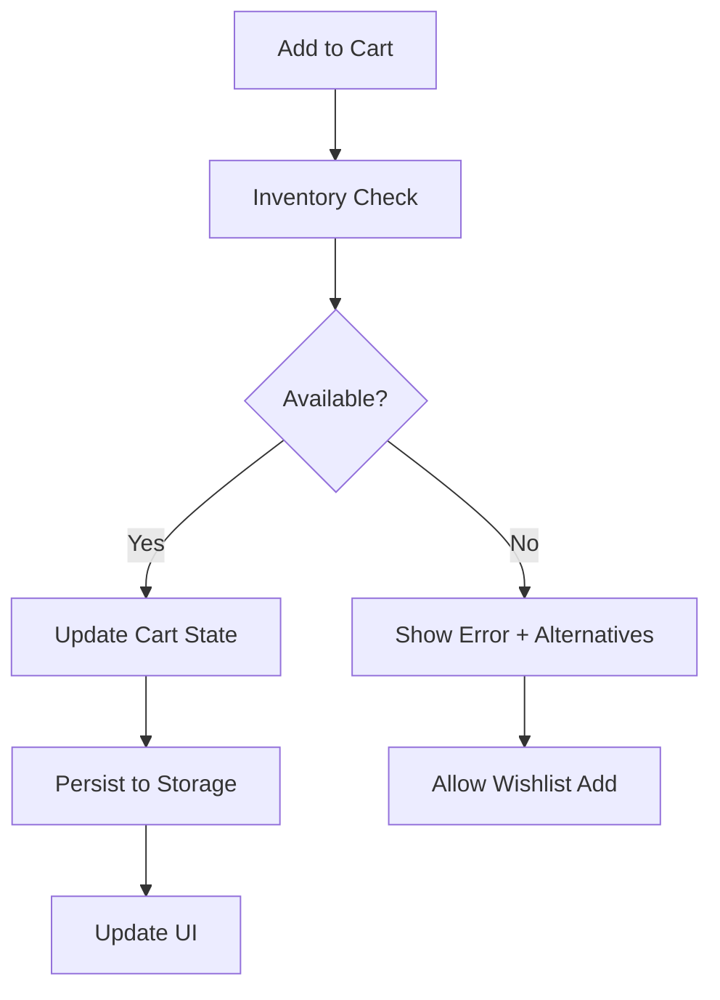

# El Camino Architecture Documentation

## Document Metadata
```yaml
version: 1.0.0
date: 2025-08-29
status: phase-1-complete
scope: architectural-enhancement-implementation
```

## System Architecture Overview

### Core Components
- **Product Detail Page (PDP)**: Server-side rendered Astro pages with client-side enhancement
- **Square API Integration**: Type-safe API layer with circuit breaker protection
- **Cart System**: Persistent cart with inventory validation and error recovery
- **Performance Monitoring**: Real-time Web Vitals tracking with business metrics
- **Error Handling**: Circuit breaker pattern with graceful degradation

### Technology Stack
- **Frontend**: Astro 5.13.2 + TypeScript 5.8.3
- **Styling**: TailwindCSS 4.1.11
- **APIs**: Square API v43.0.1
- **Testing**: Vitest 3.2.4 with happy-dom
- **Deployment**: Netlify (SSR + Edge Functions)

## API Integration Patterns

### Circuit Breaker Implementation
```typescript
// Usage Example
const circuitBreaker = errorRecovery.getCircuitBreaker('/api/inventory');
const result = await circuitBreaker.execute(
  () => fetchInventory(productId),
  () => getCachedInventory(productId) // Fallback
);
```

### Error Recovery Strategy
1. **Circuit Breaker**: Prevents cascading failures
2. **Retry Logic**: Exponential backoff for transient failures
3. **Fallback Data**: Cached responses for critical paths
4. **User Communication**: Context-aware error messages

### Performance Monitoring Integration
```typescript
// Business metrics tracking
businessMonitor.trackCustomEvent('product_view', {
  productId,
  loadTime,
  userAgent
});
```

## State Management Patterns

### Cart State Flow


### Variation Selection Logic
- Position-based attribute parsing from Square variation names
- State validation prevents UI inconsistencies  
- URL synchronization for shareable product links
- Fallback handling for malformed variation data

## Testing Strategy

### Coverage Requirements
- **Unit Tests**: Core business logic (80% coverage minimum)
- **Integration Tests**: API interactions with mocked responses
- **End-to-End Tests**: Critical user journeys
- **Performance Tests**: Web Vitals validation

### Test Structure
```
src/lib/
├── square/__tests__/
│   ├── inventory.test.ts
│   └── variationParser.test.ts
├── product/__tests__/
│   └── pdpController.test.ts
├── cart/__tests__/
│   ├── cart.test.ts
│   └── cart-integration.test.ts
└── monitoring/__tests__/
    └── errorRecovery.test.ts
```

## Performance Optimization

### Core Web Vitals Targets
- **LCP**: < 2.5s (Largest Contentful Paint)
- **FCP**: < 1.8s (First Contentful Paint)
- **CLS**: < 0.1 (Cumulative Layout Shift)
- **INP**: < 200ms (Interaction to Next Paint)
- **TTFB**: < 800ms (Time to First Byte)

### Optimization Techniques
1. **Image Optimization**: Sharp processing with WebP/AVIF support
2. **Code Splitting**: Route-based chunking
3. **API Optimization**: Request batching and deduplication
4. **Caching Strategy**: Multi-layer caching (CDN, browser, API)

## Deployment Architecture

### Production Environment
```yaml
Platform: Netlify
Runtime: Node.js 20+
Build: Astro SSR
CDN: Global edge distribution
Functions: Serverless API endpoints
```

### Environment Configuration
```typescript
// Required environment variables
SQUARE_ACCESS_TOKEN=<production_token>
SQUARE_APPLICATION_ID=<app_id>
SQUARE_ENVIRONMENT=production
MONITORING_ENDPOINT=<monitoring_url>
```

## Monitoring & Observability

### Performance Metrics
- Core Web Vitals tracking with business impact correlation
- API response time monitoring with circuit breaker integration
- Conversion funnel analysis with abandonment tracking
- Error rate monitoring with categorization

### Business Metrics
```typescript
interface BusinessMetrics {
  conversionRate: number;
  cartAbandonmentRate: number;
  avgTimeToAddCart: number;
  checkoutCompletionRate: number;
  errorRate: number;
}
```

### Alerting Thresholds
- **Performance Budget Violations**: Immediate alert
- **Error Rate > 5%**: High priority
- **Conversion Drop > 20%**: Critical priority
- **API Response Time > 2s**: Medium priority

## Security Considerations

### API Security
- Environment-based token management
- Request rate limiting via circuit breakers
- Input validation on all user inputs
- HTTPS enforcement in production

### Data Protection
- No sensitive data in localStorage
- Secure session management
- Error message sanitization to prevent information leakage

## Troubleshooting Guide

### Common Issues

**Cart State Inconsistency**
```bash
# Check cart validation
console.log('Cart state:', businessMonitor.getBusinessMetrics());
```

**Performance Issues**
```bash
# Check performance metrics
npm run test:performance
```

**API Failures**
```bash
# Check circuit breaker status
console.log('Circuit breakers:', errorRecovery.getCircuitBreaker('api-endpoint').getMetrics());
```

### Recovery Procedures
1. **API Outage**: Circuit breakers activate fallback data
2. **Performance Degradation**: Performance budgets trigger alerts
3. **Error Spike**: Retry mechanisms with exponential backoff
4. **State Corruption**: Auto-correction with user notification

## Development Workflow

### Local Development
```bash
npm run dev          # Start development server
npm run test         # Run test suite
npm run check        # Type checking
npm run build        # Production build
```

### Testing Commands
```bash
npm run test                           # All tests
npm run test src/lib/square/__tests__ # Square API tests
npm run test:coverage                  # Coverage report
```

### Deployment Process
1. **Code Review**: TypeScript compilation + tests pass
2. **Staging Deploy**: Automated via Netlify
3. **Performance Validation**: Web Vitals within budgets
4. **Production Deploy**: Manual promotion after validation

---

*Documentation updated: August 29, 2025*
*Implementation Status: Phase 1 Complete*
